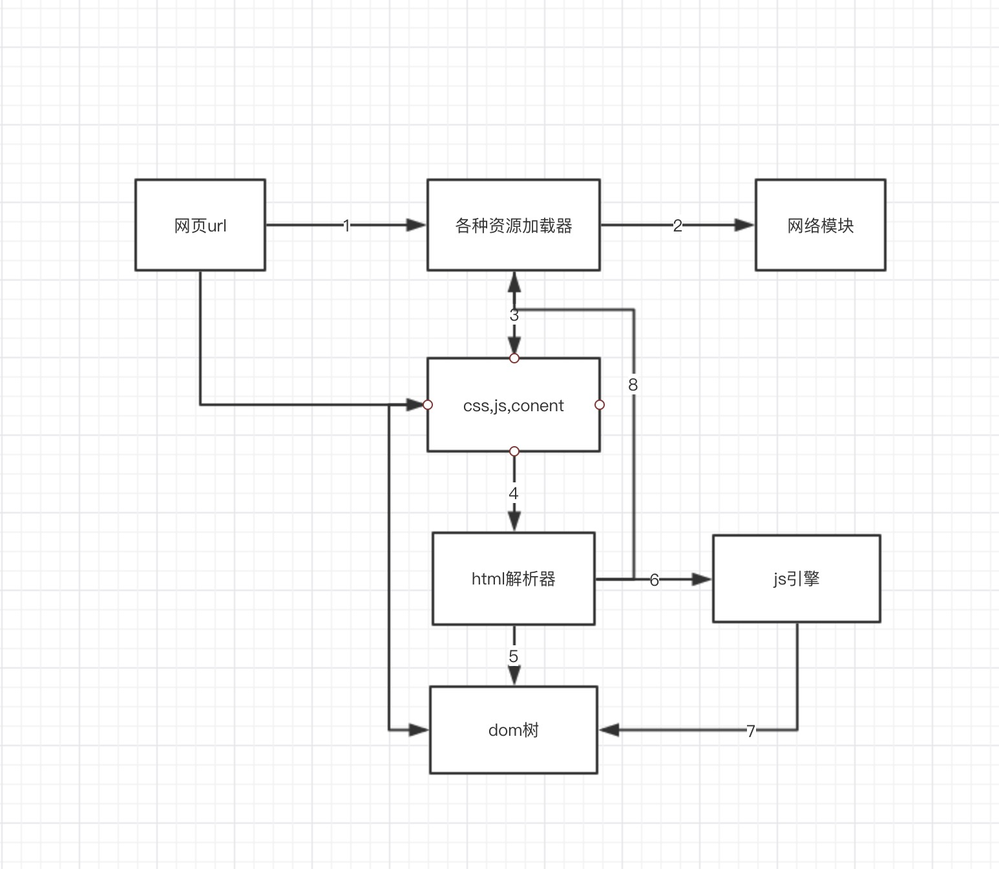

## webkit内核揭秘笔记##

1.当输入url时，浏览器调用各种资源加载器加载url对应网页的资源

2.加载器依赖网络模块建立，发送请求并接收答复

3.webkit接受各种网页或资源(包括html, css,js),可能是同步也可能是异步获取

4.html解析器开始解析获取的内容

5.构建节点，形成dom树

6.如果节点是js的话，调用js引擎解析

7.js引擎可能改变dom树结构

8.如果节点加载需要其他资源（图片，css，视频等…),调用各种资源加载器来加载，这些加载是异步的，不会影响dom树的继续创建，但是如果遇到javascript资源url且没有标记异步方式，则停止当前dom树的创建，直到javascript引擎被执行后才继续创建